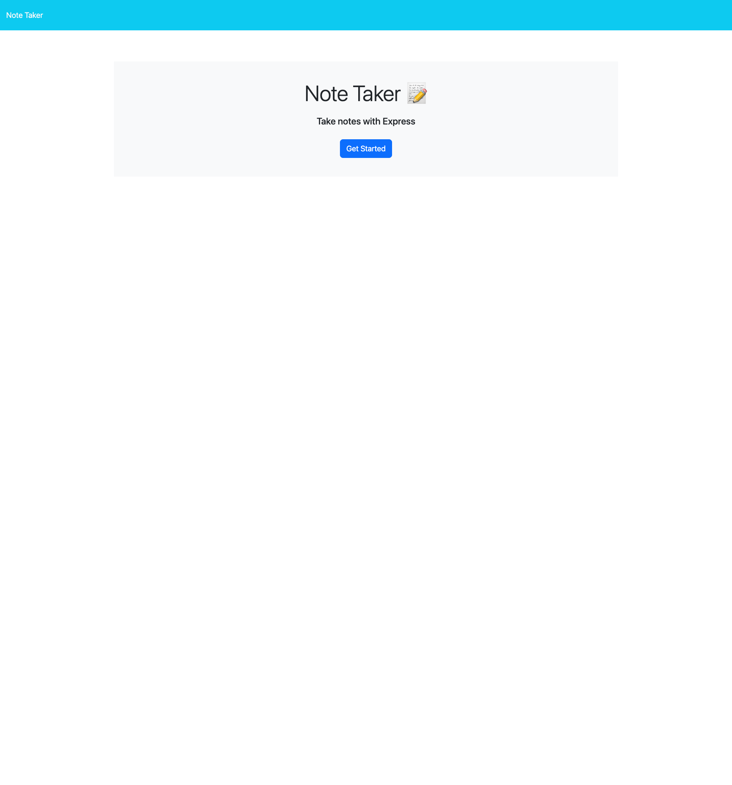
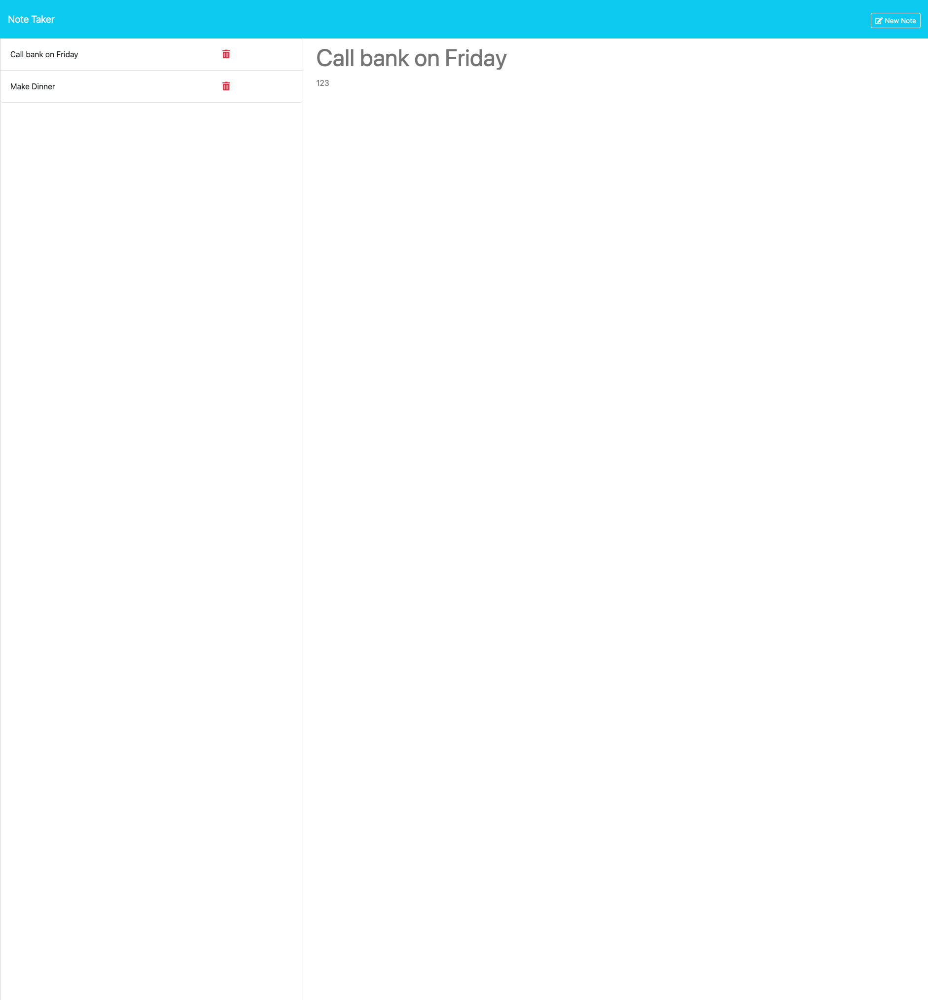

# Note Taker

## Description

A simple note taker application that gives the user the ability to save a note title and description

## Table of Contents
- [Installation](#installation)
- [Usage](#usage)
- [License](#license)
- [Questions](#questions)
- [Link to Deployed App](#link-to-deployed-app)
- [Screenshots](#screenshots)

## Installation

No installation required.

## Usage

To use Note Taker, follow the link at the bottom of the README. You can then add notes by entering in a title for the note and also a short description.

Your notes will then be stored in the sidebar. To delete a note, click on the trash icon next to the note you wish to delete.

## License

This application is covered under MIT License.

Please refer to the LICENSE file in repo for more information.

## Questions

My GitHub profile: https://github.com/jaredbartos

If you have any further questions, please contact me through email.

jaredbartos@gmail.com

## Link to Deployed App

https://note-taker-jaredbartos-a6ae3a16b976.herokuapp.com/

## Screenshots

